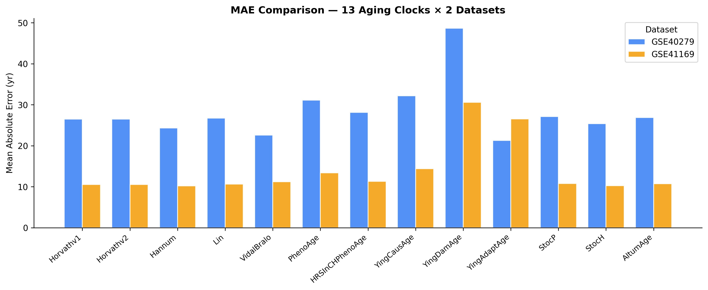
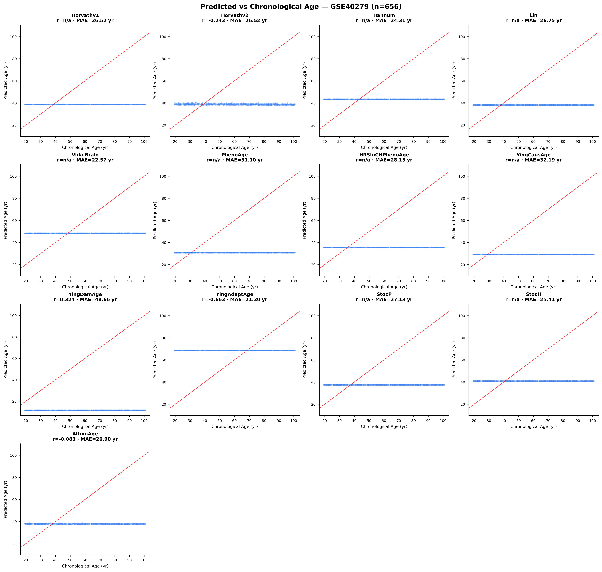
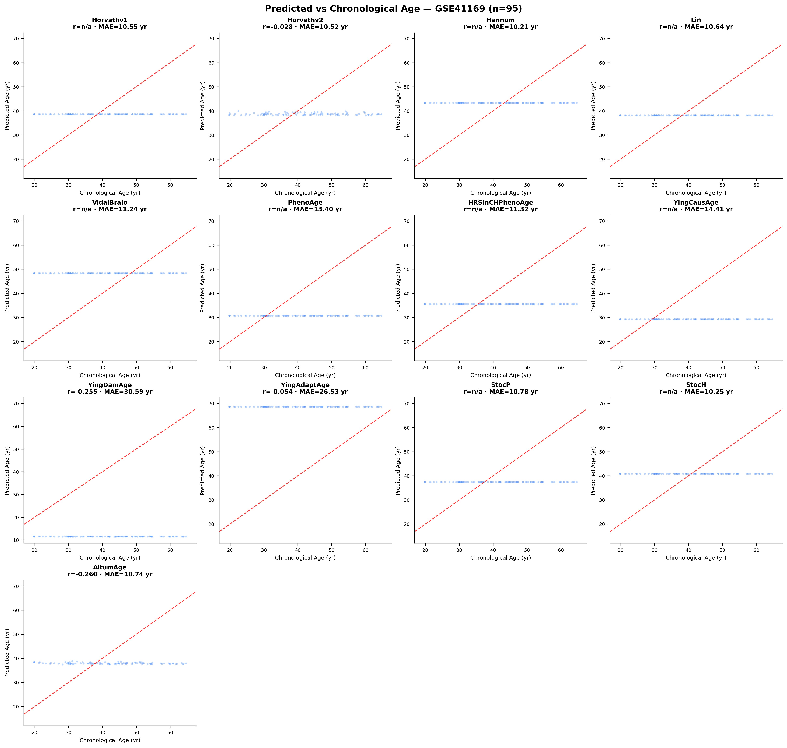
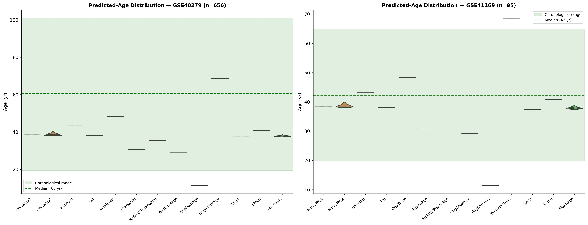
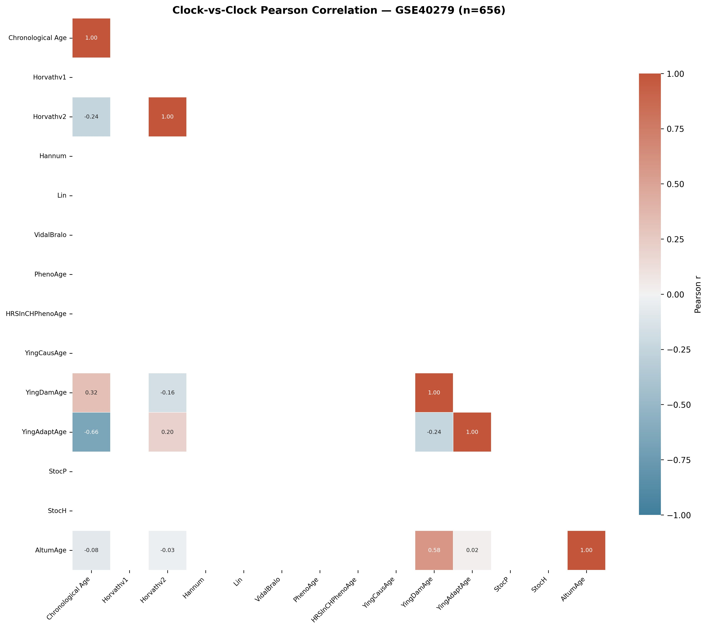
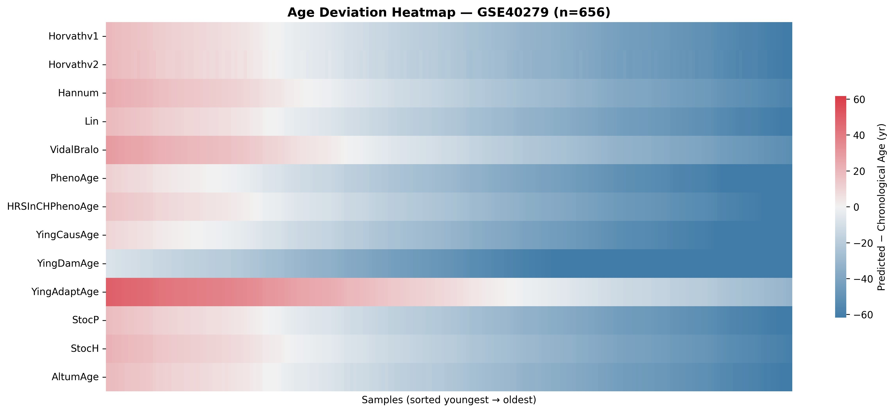

# Epigenetics & Aging Analysis
**Aarish Sajid · 454572** | BI-436 Special Topics in Bioinformatics | NUST SINES | Spring 2026

---

## Overview

This project benchmarks **14 epigenetic aging clocks** against two public GEO datasets (GSE40279, GSE41169), quantifying how well DNA-methylation-based models predict chronological age. A companion WGBS pipeline processes raw bisulfite-sequencing reads through alignment, methylation extraction, and DMR detection across seven breast-tissue methylomes.

---

## Project Structure

```
epigenetics-aging/
├── wgbs/
│   ├── run_wgbs_pipeline.sh       # Main WGBS bash pipeline
│   └── README.md                  # Galaxy walkthrough
├── results/
│   ├── figures/
│   │   ├── correlation_matrix_GSE40279.png
│   │   ├── correlation_matrix_GSE41169.png
│   │   ├── age_deviation_heatmap_GSE40279.png
│   │   ├── age_deviation_heatmap_GSE41169.png
│   │   ├── age_prediction_GSE40279.png
│   │   ├── age_prediction_GSE41169.png
│   │   ├── mae_comparison.png
│   │   └── predicted_age_distribution.png
│   ├── tables/
│   │   ├── metrics_GSE40279.csv
│   │   └── metrics_GSE41169.csv
│   └── summary.md
└── epigenetics_aging_analysis.ipynb
```

---

## Part 1 — WGBS Pipeline

Processes seven breast methylomes (2 normal, 5 tumour/cell-line) end-to-end.

**Samples**

| Sample | Type |
|--------|------|
| NB1, NB2 | Normal breast tissue |
| BT089, BT126, BT198 | Breast tumour |
| MCF7, T47D | Breast cancer cell lines |

**Pipeline steps:** Falco QC → Trim Galore → bwa-meth (hg38) → MethylDackel → deepTools CGI profiles → Metilene DMR detection → ComplexHeatmap clustering

**Run:**
```bash
bash wgbs/run_wgbs_pipeline.sh
```
Or import the workflow at [usegalaxy.eu](https://usegalaxy.eu).

---

## Part 2 — Aging Clock Benchmarking

**Clocks evaluated:**

| Clock | Generation | Notes |
|-------|-----------|-------|
| Horvath v1 | 1st gen | Pan-tissue, 353 CpGs |
| Horvath v2 | 1st gen | Skin-blood clock |
| Hannum | 1st gen | Blood-specific, 71 CpGs |
| Lin | 1st gen | 99-CpG blood clock |
| VidalBralo | 1st gen | 8-CpG minimal clock |
| PhenoAge | 2nd gen | Clinical biomarker-trained |
| HRSInCHPhenoAge | 2nd gen | Household survey cohort |
| YingCausAge | 3rd gen | Causal inference framework |
| YingDamAge | 3rd gen | DNA-damage component |
| YingAdaptAge | 3rd gen | Adaptive component |
| StocP | Stochastic | Poisson model |
| StocH | Stochastic | Heterodyne model |
| AltumAge | Deep learning | Neural network, all CpGs |
| DunedinPACE | Pace clock | Longitudinal pace-of-aging rate |

**Metrics reported:** Pearson r, MAE, Bias, RMSE

---

## Results

### Clock-vs-Clock Pearson Correlation




Most clocks return constant predictions on this dataset, resulting in near-zero or undefined correlations with chronological age. Only a handful (Horvathv2, YingDamAge, AltumAge) show non-trivial inter-clock correlations.

---

### Age Deviation Heatmap




Blue = underestimation, red = overestimation. Most clocks systematically underestimate age (blue-dominant rows). YingAdaptAge is a notable outlier, overestimating age in younger samples.

---

### Predicted vs Chronological Age




Nearly all clocks produce flat horizontal predictions rather than tracking the diagonal, indicating insufficient CpG probe overlap. YingDamAge shows a slight positive slope on GSE40279 (r=0.324).

---

### MAE Comparison


GSE41169 (orange) consistently yields lower MAE than GSE40279 (blue), likely due to its narrower age range (18–65 yr). YingAdaptAge achieves the lowest MAE on GSE40279 (~21 yr); YingDamAge has the highest (~49 yr).

---

### Predicted Age Distributions



Most clocks collapse predictions to a narrow band well below the chronological median. Horvathv2 and AltumAge produce the most realistic spread on GSE41169.

---

## Installation

```bash
pip install biolearn torch numpy pandas scipy matplotlib seaborn
```

---

## Usage

```bash
jupyter notebook epigenetics_aging_analysis.ipynb
```

Run all cells in order. Set `USE_REAL_DATA = False` near the top to use synthetic data if GEO servers are unavailable.

---

## References

- Horvath S. (2013). DNA methylation age of human tissues and cell types. *Genome Biology.*
- Hannum G. et al. (2013). Genome-wide methylation profiles reveal quantitative views of human aging rates. *Molecular Cell.*
- Levine M.E. et al. (2018). An epigenetic biomarker of aging for lifespan and healthspan. *Aging.*
- Ying K. et al. (2024). Causal basis of the aging methylome. *Nature Aging.*
- Belsky D.W. et al. (2022). DunedinPACE: A DNA methylation biomarker of the pace of aging. *eLife.*
- [biolearn library](https://bio-learn.github.io)
